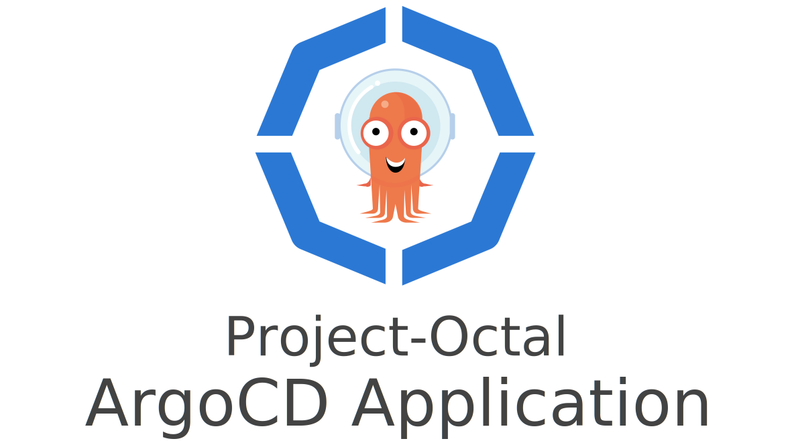

---

A Terraform module for provisioning and configuring ArgoCD applications.
This module can be used with or without the Project-Octal [terraform-kubernetes-argocd](https://github.com/project-octal/terraform-kubernetes-argocd) module.
The only hard requirement is a Kubernetes cluster with a functioning ArgoCD deployment and project for the application to reside in.

---

***Note:*** This repository has been renamed from `terraform-argocd-application` to `terraform-kubernetes-argocd-application`
 to better follow the [Terraform module naming convention](https://www.terraform.io/docs/registry/modules/publish.html). 

--- 

### Update from v1.0.5
When upgrading from v1.0.5 or older to v2.0.0+ you will need to import all the argocd application manifests

**Import the resource state from the cluster**
```shell
# Import the ArgoCD application using the new provider
terraform import -var-file=secrets.tfvars 'module.kubedb_argocd_application.kubernetes_manifest.argo_application' "apiVersion=argoproj.io/v1alpha1,kind=Application,namespace=kube-argocd,name=kubedb"

# Delete the state reference to the old k8s_manifest object
terraform state rm 'module.kubedb_argocd_application.k8s_manifest.argo_application' 
```

### Example
```hcl-terraform

module "project" {
  source  = "project-octal/argocd-project/kubernetes"
  version = "2.0.0"
  
  argocd_namespace = data.terraform_remote_state.infra.outputs.cluster_argocd_namespace
  name             = local.instance_name
  description      = local.project_description
  destinations = [
    {
      server    = "https://kubernetes.default.svc"
      namespace = kubernetes_namespace.kergiva_namespace.metadata.0.name
    }
  ]
}

module "argocd_application" {
  source  = "project-octal/argocd-application/kubernetes"
  version = "2.0.0"

  argocd_namespace    = "kube-argocd"
  destination_server  = "https://kubernetes.default.svc"
  project             = module.project.name
  name                = "example-application-name"
  namespace           = "argo-project-permitted-namespace"
  repo_url            = "https://argo-project-permitted-repo-url/"
  chart               = "foo-chart"
  target_revision     = "0.0.1"
  helm_values         = {
      helm_values = "go-here"
  }
  automated_self_heal = true
  automated_prune     = true
  labels              = {
      custom = "lables-to-apply"
  }
}

// The following module will create app that deploys from git repo under chart directory
// chart variable is applicable for git based application sources. For that reason, it should be set empty
// Otherwise, argocd app will be in unknown state

module "argocd_application_git" {
  source  = "project-octal/argocd-application/kubernetes"
  version = "2.0.0"

  argocd_namespace    = "kube-argocd"
  destination_server  = "https://kubernetes.default.svc"
  project             = module.project.name
  name                = "example-application-name"
  namespace           = "argo-project-permitted-namespace"
  repo_url            = "git@github.com:myorg/myrepo.git"
  chart               = ""
  path                = "Chart"  // location of helm chart in the git repo
  target_revision     = "master" // git branch name
  helm_values         = {
      helm_values = "go-here"
  }
  automated_self_heal = true
  automated_prune     = true
  labels              = {
      custom = "lables-to-apply"
  }
}
```

<!-- BEGIN_TF_DOCS -->
## Requirements

| Name | Version |
|------|---------|
| <a name="requirement_terraform"></a> [terraform](#requirement\_terraform) | >= 0.14.8, < 2.0.0 |

## Providers

| Name | Version |
|------|---------|
| <a name="provider_kubernetes"></a> [kubernetes](#provider\_kubernetes) | 2.6.1 |

## Modules

No modules.

## Resources

| Name | Type |
|------|------|
| [kubernetes_manifest.argo_application](https://registry.terraform.io/providers/hashicorp/kubernetes/latest/docs/resources/manifest) | resource |

## Inputs

| Name | Description | Type | Default | Required |
|------|-------------|------|---------|:--------:|
| <a name="input_argocd_namespace"></a> [argocd\_namespace](#input\_argocd\_namespace) | The name of the target ArgoCD Namespace | `string` | n/a | yes |
| <a name="input_automated_prune"></a> [automated\_prune](#input\_automated\_prune) | Specifies if resources should be pruned during auto-syncing | `bool` | `false` | no |
| <a name="input_automated_self_heal"></a> [automated\_self\_heal](#input\_automated\_self\_heal) | Specifies if partial app sync should be executed when resources are changed only in target Kubernetes cluster and no git change detected | `bool` | `false` | no |
| <a name="input_cascade_delete"></a> [cascade\_delete](#input\_cascade\_delete) | Set to true if this application should cascade delete | `bool` | `false` | no |
| <a name="input_chart"></a> [chart](#input\_chart) | The name of the Helm chart | `string` | n/a | yes |
| <a name="input_destination_server"></a> [destination\_server](#input\_destination\_server) | n/a | `string` | `"https://kubernetes.default.svc"` | no |
| <a name="input_helm_parameters"></a> [helm\_parameters](#input\_helm\_parameters) | Parameters that will override helm\_values | <pre>list(object({<br>    name : string,<br>    value : any,<br>    force_string : bool,<br>  }))</pre> | `[]` | no |
| <a name="input_helm_values"></a> [helm\_values](#input\_helm\_values) | Helm values as a block of yaml | `any` | `{}` | no |
| <a name="input_ignore_differences"></a> [ignore\_differences](#input\_ignore\_differences) | Ignore differences at the specified json pointers | `list(object({ kind : string, group : string, name : string, jsonPointers : list(string) }))` | `[]` | no |
| <a name="input_labels"></a> [labels](#input\_labels) | n/a | `map(string)` | `{}` | no |
| <a name="input_name"></a> [name](#input\_name) | The name of this application | `string` | n/a | yes |
| <a name="input_namespace"></a> [namespace](#input\_namespace) | n/a | `string` | n/a | yes |
| <a name="input_path"></a> [path](#input\_path) | n/a | `string` | `""` | no |
| <a name="input_project"></a> [project](#input\_project) | The project that this ArgoCD application will be placed into. | `string` | n/a | yes |
| <a name="input_release_name"></a> [release\_name](#input\_release\_name) | Release name override (defaults to application name) | `string` | `null` | no |
| <a name="input_repo_url"></a> [repo\_url](#input\_repo\_url) | Source of the Helm application manifests | `string` | n/a | yes |
| <a name="input_retry_backoff_duration"></a> [retry\_backoff\_duration](#input\_retry\_backoff\_duration) | The amount to back off. Default unit is seconds, but could also be a duration (e.g. `2m`, `1h`) | `string` | `"5s"` | no |
| <a name="input_retry_backoff_factor"></a> [retry\_backoff\_factor](#input\_retry\_backoff\_factor) | A factor to multiply the base duration after each failed retry | `number` | `2` | no |
| <a name="input_retry_backoff_max_duration"></a> [retry\_backoff\_max\_duration](#input\_retry\_backoff\_max\_duration) | The maximum amount of time allowed for the backoff strategy | `string` | `"3m"` | no |
| <a name="input_retry_limit"></a> [retry\_limit](#input\_retry\_limit) | Number of failed sync attempt retries; unlimited number of attempts if less than 0 | `number` | `5` | no |
| <a name="input_sync_option_create_namespace"></a> [sync\_option\_create\_namespace](#input\_sync\_option\_create\_namespace) | Namespace Auto-Creation ensures that namespace specified as the application destination exists in the destination cluster. | `bool` | `true` | no |
| <a name="input_sync_option_validate"></a> [sync\_option\_validate](#input\_sync\_option\_validate) | disables resource validation (equivalent to 'kubectl apply --validate=true') | `bool` | `false` | no |
| <a name="input_sync_options"></a> [sync\_options](#input\_sync\_options) | A list of sync options to apply to the application | `list(string)` | `[]` | no |
| <a name="input_target_revision"></a> [target\_revision](#input\_target\_revision) | Revision of the Helm application manifests to use | `string` | `""` | no |

## Outputs

No outputs.
<!-- END_TF_DOCS -->
